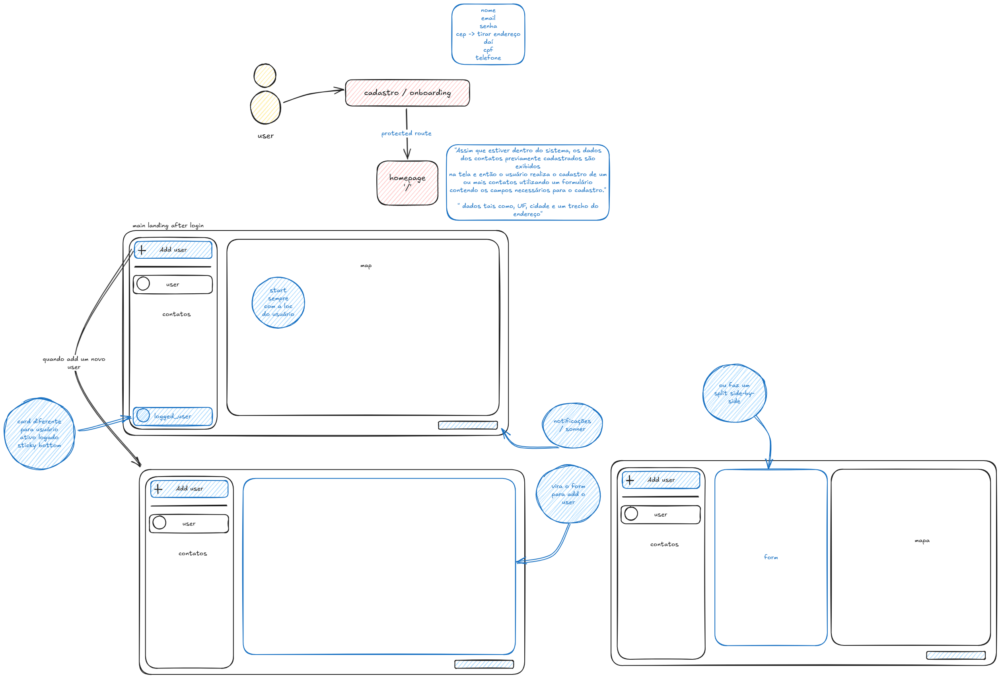
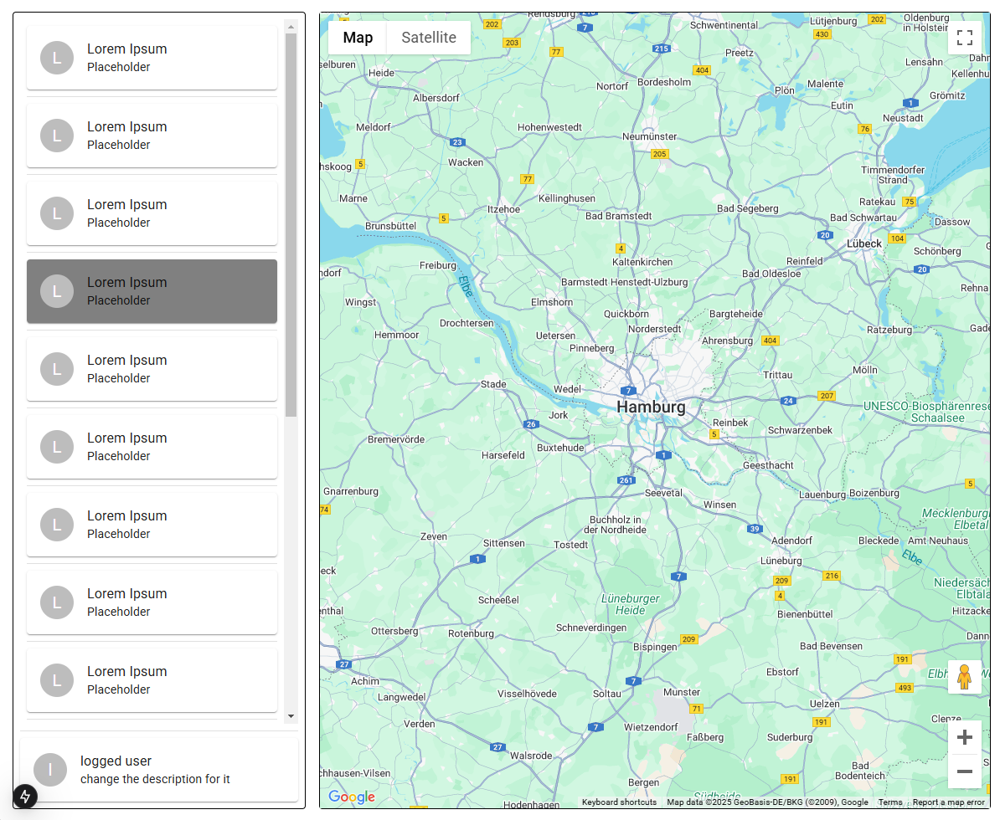

# 07-02-25

Vou começar o dia fazendo um mock pro front, quero conseguir montar +- a jornada de usuário, a partir daí vou fazendo as conexões com a api do maps e o db

Comecei a ver como é o material design v3, até agora eu sempre usei shadcn ou nextui como component libs, achei um playground legal pra entender como são os estilos e componentes

---

Pensei em uma forma legal de formular esse app

Tudo fica bem self-contained, dá pra reaproveitar o espaço de UI pra várias coisas
Acho que o primeiro passo realmente é buildar esse front pra ver como as coisas vão integrar mais tarde, por enquanto o que me preocupa é a visualização do mapa em sí
Adoraria fazer um mapa 3D em globo com animações e etc, mas é importante me manter grounded e fazer o necessário antes de mais nada

---

Ok, MUI ta sendo defnitivamente algo
Eu me acostumei muito mal com tailwind, escrever css 'puro' ta sendo um fluxo de trabalho bem diferente, mas até agora, tudo bem!!

---
Consegui criar uma interface bem simples e básica, já com o mapa implementado

Quero começar a pensar mais como vou implementar os requisitos relacionados ao mapa, pins, localizações, search, etc
Agora que eu tenho uma interface simples, vou pensar mais na funcionalidade em sí

- cada user ter uma loc diferente
- registrar novos users

---
Implementei um sisteminha bem simples de localizações de usuários (adicionei um prop com latitude e longitude no componente de card), mas estou me batendo um pouco pra reendenizar o mapa corretamente com as localizações e manter a funcionalidade de drag & zoom

> Entendi o que fazer!!! (15 mins depois)

---

# TODO

- [ ] sidebar w clients
  - [ ] cards
  - [ ] userprofile
- [ ] maps integration
