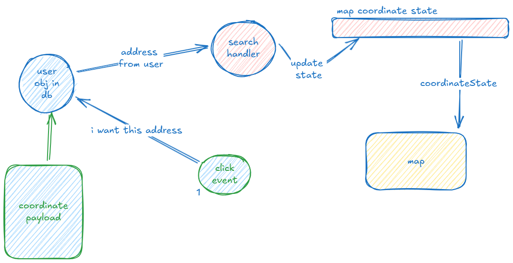

# 08-02-25

Novo dia
Acordei bem inspirado pra adicionar mais coisas ao projeto, acho que implementar o toggle de darkMode vai me fazer pegar o rítimo

---
Turns out que era isso mesmo que eu precisava, consegui implementar bastante coisa até agora:

- theme toggling
- sqlite db + orm
- api routes

os próximos passos agora vão ser implementar:

- rotas protegidas (access-tokens)
- login / logout
- adicionar contatos
- polir a UI

---

Nas últimas horas consegui implementar bastante coisa, to num rítimo legal
Quero implementar o search box do google maps agora, achei alguns exemplos usando a lib go vis.gl que usei pro mapa em sí
Espero que dê certo, quero reduzir o número de dependências usadas a um mínimo

Decidi implementar a search bar direto no componente do mapa, apesar de isso causar uma certa inconveniencia pela falta de componentização, causaria muito prop drilling desencessário
Mas por outro lado, acho importante criar um componente stand-alone pra usar na UI pra procurar endereços no cadastro
Vou tentar criar um por sí próprio, vemos o que acaba sendo melhor

---
Implementei a search bar!! muito cool!
As proximas features vão ser:

`A plataforma possui um sistema de ajuda para o preenchimento do endereço do contato, onde o
usuário pode informar alguns dados tais como, UF, cidade e um trecho do endereço e esse sistema
de ajuda apresenta então as possibilidades de endereço baseado na pesquisa, dessa forma o
usuário escolhe na lista qual o endereço lhe convém e tem os campos do formulário
correspondente preenchidos automaticamente.

Quando o usuário quer localizar um contato na lista, ele utiliza um filtro de texto que traz apenas os
contatos que contém o nome ou CPF equivalente ao termo pesquisado.

Sempre que o usuário clica no contato da lista, o mapa deve centralizar e marcar com um “pin” a
coordenada geográfica obtida através do cadastro`

---

Implementando a centralização do mapa no endereço da pessoa selecionada, pensei como vou fazer isso
No momento, o db só tem os campos

```prisma

model User {
    id        String   @id @default(uuid())
    email     String
    cpf       String
    phone     String
    pass      String
    name      String?
    address   Address? @relation(fields: [addressId], references: [id])
    addressId String?
}

```

acho que seria um pouco bobo armazenar o endereço direto no campo do usuário, criei uma rota de api justamente pra puxar endereços por id's
(talvez seja melhor eu atualizar ela pra usar lat & long)


